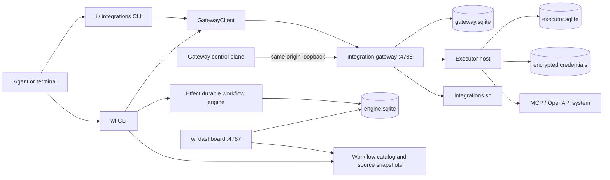

# System architecture and call stacks

The system has two related execution paths: durable workflows through `wf`, and
integration administration/invocation through `i` (the short alias of
`integrations`). The gateway is the only process that sees decrypted
credentials.

## Components



## Authority and storage

| Component | Holds | Does not hold |
| --- | --- | --- |
| Workflow definition | integration alias and tool name | connection, API key, vendor credential |
| `wf` process | local gateway API key while calling | decrypted vendor credential |
| `i` process | local or explicitly supplied gateway API key; credential env value during connect | persisted vendor credential |
| Gateway | clients, grants, policy, approvals, audit; access to Executor | workflow execution state |
| Executor host | integration catalog, connections, encrypted credential references; decrypted value during a call | grants or gateway clients |
| Durable engine | workflow journal, timers, signal waits, JSON step results | integration credentials |

The three databases are intentionally separate:

- `engine.sqlite` answers what happened in a workflow and what must replay.
- `executor.sqlite` answers which integrations, connections, and tools exist.
- `gateway.sqlite` answers who may use which tool through which connection.

## Gateway request path

`createGatewayService` builds a scoped `ManagedRuntime` containing the gateway
store, Executor host, and derived Executor services. It then creates the OAuth
session manager, maintenance loop, route table, and request handler. Bun owns
the socket; `RunningGateway.stop()` stops the socket and disposes the runtime.

For every `/v1/*` request:

1. `createGatewayHandler` matches a data-defined route.
2. It extracts a bearer or `x-api-key` credential. The control plane may borrow
   the local credential only for same-origin browser traffic over loopback.
3. A delegated route authenticates a live key. A privileged route additionally
   requires the client to have `mayMutate`.
4. The route decodes its body with Effect Schema and calls store/Executor
   services.
5. The handler serializes the route result or returns a bounded error response.

## `i search` call stack

Example:

```bash
i search linear --kind mcp --limit 5
```

```text
Effect CLI Command.runWith
  -> searchCommand
    -> gatewayTask
      -> connectToGateway
        -> resolveClientConnection
          -> INTEGRATIONS_URL + INTEGRATIONS_API_KEY, or ~/.wf/gateway.json
        -> createGatewayClient
      -> GatewayClient.request(GET /v1/registry/search?q=linear&kind=mcp&limit=5)
        -> Bun gateway createGatewayHandler
          -> matchRoute
          -> authorizeMutation (search is privileged)
            -> authenticateClient
              -> hash presented key
              -> GatewayStore.findApiKeyByHash
              -> GatewayStore.findClientById + touchApiKey
          -> registry search route
            -> searchIntegrations
              -> integrations.sh registry HTTP API
          -> JSON response
          -> command renders the JSON response
```

Search is read-only with respect to the Executor catalog, but it is privileged
because it is part of the catalog-management surface. `i discover <url>` is the
separate operation that detects and persists a result.

## `i connect` call stack

Example:

```bash
i connect linear
```

The command first reads `/v1/integrations` to find the persisted integration and
its discovered auth methods. It then takes one of two paths.

### API key, bearer, or no auth

```text
connectCommand
  -> read credential values from named client environment variables
  -> GatewayClient.request(POST /v1/connections)
    -> gateway privileged authentication
    -> gateway route decodes ConnectBody
    -> ExecutorServices.catalog.find(integration)
      -> ExecutorRunner.run -> Executor SDK integration catalog
    -> selectAuthMethod
    -> ExecutorServices.connections.create
      -> ExecutorRunner.run
        -> Executor SDK connections.create
          -> fileCredentialProvider.set
            -> AES-256-GCM seal
            -> atomic executor-auth.json replacement
          -> executor.sqlite connection metadata
    -> ExecutorServices.tools.summaries for the new connection
    -> connection + tool summary response
  -> command prints the normalized stored connection name and next command
```

The credential value crosses the CLI-to-gateway request once. It is encrypted
inside the gateway process and is never returned.

### OAuth

```text
connectCommand
  -> GatewayClient.request(POST /v1/connections/oauth)
    -> gateway privileged authentication
    -> catalog.find + OAuth auth-method selection
    -> OAuthSessions.start
      -> authorizeExecutorInBrowser
        -> start loopback callback server
        -> ExecutorServices.auth.probe (when discovery is configured)
        -> auth.registerClient or auth.createClient
        -> auth.start (authorization code + PKCE)
        -> return authorization URL
  -> CLI prints/opens authorization URL
  -> CLI polls GET /v1/connections/oauth/:id
  -> provider redirects browser to gateway's ephemeral loopback callback
    -> verify OAuth state
    -> ExecutorServices.auth.complete
      -> Executor SDK exchanges code and persists the connection/credential
    -> OAuthSessions changes pending -> connected (or failed)
  -> next CLI poll receives the connection
```

The gateway, not the CLI, owns the callback server and token exchange. The CLI
only opens a URL and polls session state.

## `i execute` call stack

Delegated example:

```bash
i execute issues create_issue '{"title":"Investigate replay"}'
```

```text
executeCommand
  -> Schema-decode JSON argument
  -> GatewayClient.execute(POST /v1/execute)
    -> gateway handler delegated authentication
    -> execute route decodes alias, tool, arguments
    -> invokeThroughGateway
      -> authorizeInvocation
        -> authenticateClient again
        -> GatewayStore.findGrant(client, alias, tool)
        -> resolve grant -> connection + policy decision
      -> require_approval?
        -> find existing uncollected approval by canonical arguments
        -> return pending, collect a settled result once, or create approval
      -> allow
        -> executeAuthorized
          -> grantToolAddress(connection, tool)
          -> ExecutorServices.tools.execute(address, arguments)
            -> ExecutorRunner.run
              -> Executor SDK execute
                -> resolve connection
                -> decrypt/inject credential
                -> call MCP or OpenAPI vendor
            -> decode Executor result
            -> normalize MCP structured content / JSON text / plain text
          -> GatewayStore.recordAudit
      -> InvocationOutcome
  -> print the complete outcome JSON
```

The handler currently authenticates the delegated request before dispatch and
`authorizeInvocation` authenticates it again while resolving the grant. This is
redundant work, but it keeps `invokeThroughGateway` safe when called outside the
HTTP route and makes it the single authorization entry point.

When policy requires approval, the gateway freezes the exact invocation and
returns `pending`. Approval executes the tool inside the gateway. A retry with
the same canonical arguments collects that stored outcome exactly once; it does
not receive a reusable capability.

Direct example:

```bash
i execute --direct tools.linear.org.default.create_issue '{"title":"Probe"}'
```

The direct path calls privileged `POST /v1/tools/invoke`, skips grants, and
executes the supplied address. It exists to test a connection immediately after
setup. It still requires a `mayMutate` client key.

## Workflow integration call stack

When `wf run` reaches an integration step:

```text
wf run
  -> WorkflowClient.start / WorkflowRuntime.execute
  -> Effect WorkflowEngine durable activity
  -> ExecutionResourceRegistry.integrations
  -> createGatewayIntegrationInvoker.invoke(alias, tool, input)
  -> lazy GatewayClient resolution
  -> the delegated /v1/execute stack above
  -> result validated against the step output Schema
  -> activity result persisted in engine.sqlite
```

A `pending` approval is thrown as `ApprovalPendingError`, which the durable step
treats as transient and retries. A later retry collects the gateway-performed
result. Credentials and resolved tool addresses never enter workflow source or
durable history.
